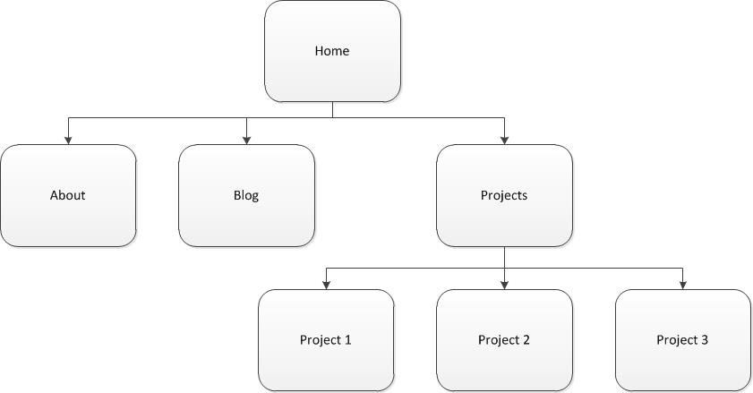

## Design Reflection

The six phases of web design are:
..- **Information Gathering** - Determine the purpose, goals, target audience, and content for the web page
..- **Planning** - Create sitemap to ensure easy navigation
..- **Design** - Determine the look and feel of the site through prototype
..- **Development** - Create website based on prototype
..- **Testing and Delivery** - Determine if development was successful
..- **Maintenance** - Ongoing changes to the site

The purpose of my site is to represent my abilities as a web developer. It will include examples of my work, an about page to describe who I am and various links to me on social media. The target audience will be people who want to learn more about me and the primary action of a user will be viewing my portfolio.

Design and user experience are very important to a website because they help acheive the sites goals. User experience is how a person feels when interfacing with a system
