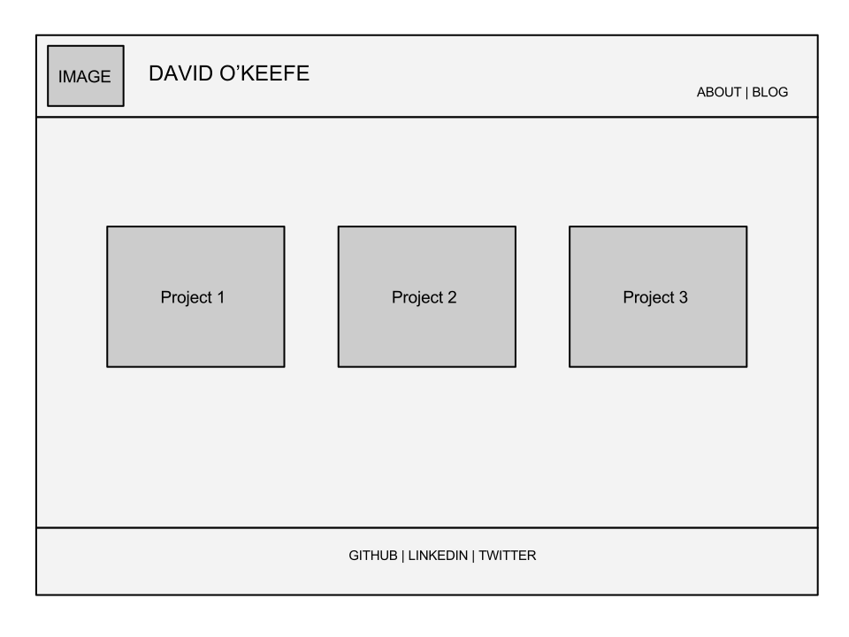
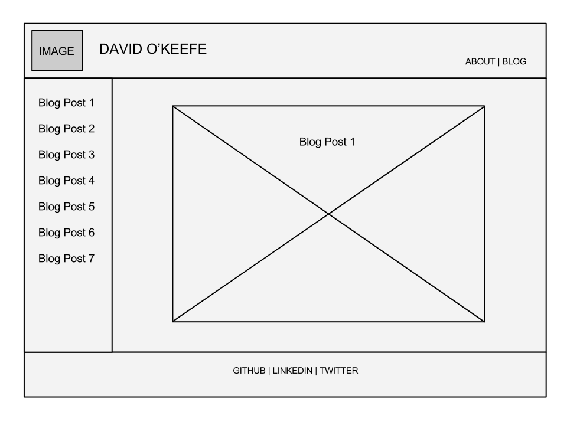

## Wireframe Reflection

A wireframe is a visual representation of a websites layout and navigation. Wireframing allows you to plan the layout for your site before development begins, similar to how an architect would create blueprints before construction begins. Wireframes are an early look and can help determine requirements. Seeing the content laid out on the page can help determine how a user will interact with the site.

My first attempt at wireframing was challenging. This was definitely a rabbit hole where I could get lost for hours researching. I spent a long time playing with various wireframe tools before settling on a free option and just using Google Draw to create some basic wireframes. I revised a few times while coming up with my initial idea and then again after sleeping on it.

This challenge made me consider many questions about layout and design. I spent some time looking at various wireframe images, existing websites, and wordpress themes. 

