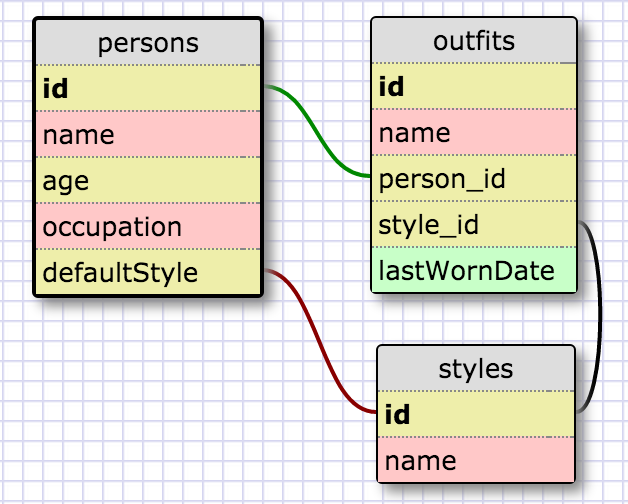

###1. Select all data for all states.
```
  SELECT *
  FROM states;
```
###2. Select all data for all regions.
```
  SELECT *
  FROM regions;
```
###3. Select the state_name and population for all states.
```
  SELECT state_name, population
  FROM states;
```
###4. Select the state_name and population for all states ordered by population. The state with the highest population should be at the top.
```
  SELECT state_name, population
  FROM states
  ORDER BY states.population DESC;
```
###5. Select the state_name for the states in region 7.
```
  SELECT state_name
  FROM states
  WHERE region_id = 7;
```
###6. Select the state_name and population_density for states with a population density over 50 ordered from least to most dense.
```
  SELECT state_name, population_density
  FROM states
  WHERE population_density > 50
  ORDER BY population_density;
```
###7. Select the state_name for states with a population between 1 million and 1.5 million people.
```
  SELECT state_name
  FROM states
  WHERE population BETWEEN 1000000 AND 1500000;
```
###8. Select the state_name and region_id for states ordered by region in ascending order.
```
  SELECT state_name, region_id
  FROM states
  ORDER BY region_id;
```
###9. Select the region_name for the regions with "Central" in the name.
```
  SELECT region_name
  FROM regions
  WHERE region_name LIKE '%Central%';
```
###10. Select the region_name and the state_name for all states and regions in ascending order by region_id. Refer to the region by name. (This will involve joining the tables).
```
  SELECT regions.region_name, states.state_name
  FROM states
  JOIN regions
  ON regions.id = states.region_id
  ORDER BY states.region_id;
```

###Outfits Schema


###Reflection

- Q: What are databases for?
- A: Databases are for managing and organizing data so it can be accessed.

- Q: What is a one-to-many relationship?
- A: A one-to-many relationship is where one element can be related to many other elements. For example, one music album can have many tracks.

- Q: What is a primary key? What is a foreign key? How can you determine which is which?
- A: A primary key is how each record in the database is uniquely identified. A foreign key is a reference in one table to a column in another table.

- Q: How can you select information out of a SQL database? What are some general guidelines for that?
- A: You select information by specifying the columns you'd like to extract, the tables that contain the data, and the conditions when data should be extracted.

