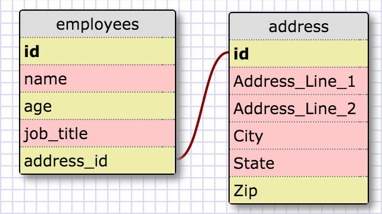
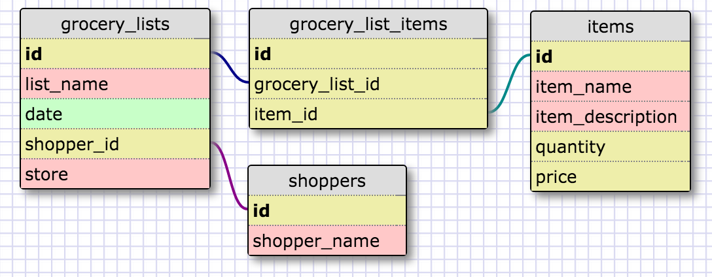

###One to One Schema

In the following relationship, each employee has one unique address. Each address has multiple columns so it makes sense to keep this info on a table separate from the employee table.

###Many to Many Relationship

- Q: What is a one-to-one database?
- A: It's a relationship where values on two tables are unique to each other.

- Q: When would you use a one-to-one database? (Think generally, not in terms of the example you created).
- A: You would use it when some of the unique information can be distinctly categorized.

- Q: What is a many-to-many database?
- A: It's a relationship where values from both tables can be related to each other in multiple different ways.

- Q: When would you use a many-to-many database? (Think generally, not in terms of the example you created).
- A: You would use it when creating multiple instances that can contain data from multiple tables.

- Q: What is confusing about database schemas? What makes sense?
- A: Nothing too confusing. I've done a lot of SQL querying but I've never created schemas. It was fun!
